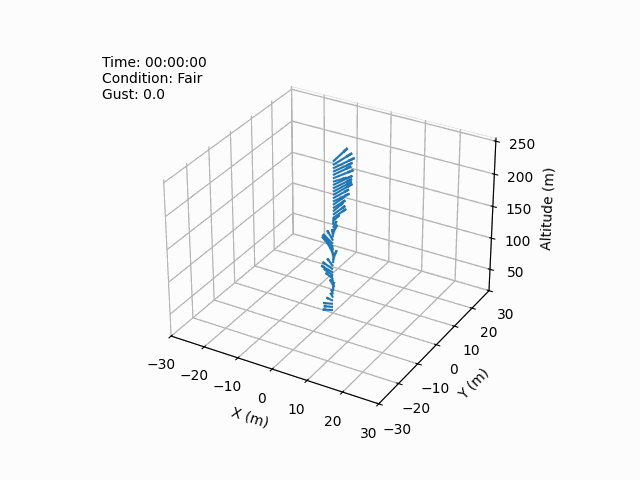

# Wind Diffusion Modeling



*An animation of a single day of sodar sensor readings (taken in 2 minute intervals) with their corresponding macroweather forecast.*

## Abstract

Motivated by the pursuit of safe, reliable, and weather-tolerant urban air mobility (UAM) solutions, this work proposes a generative modeling approach for characterizing microweather wind velocities. 
Microweather, or the weather conditions in highly localized areas, is particularly complex in urban environments owing to the chaotic and turbulent nature of wind flows. 
Furthermore, traditional means of assessing local wind fields are not generally viable solutions for UAM applications: 1) field measurements that would rely on permanent wind profiling systems in operational air space are not practical, 2) physics-based models that simulate fluid dynamics at a sufficiently high resolution are not computationally tractable, and 3) data-driven modeling approaches that are largely deterministic ignore the inherent variability in turbulent flows that dictates UAM reliability. 
Thus, advancements in predictive capabilities are needed to help mitigate the unique operational safety risks that microweather winds pose for smaller, lighter weight UAM aircraft. 

This work aims to model microweather wind velocities in a manner that is computationally-efficient, captures random variability, and would only require a temporary, rather than permanent, field measurement campaign. 
Inspired by recent breakthroughs in conditional generative AI such as text-to-image generation, the proposed approach learns a probabilistic macro-to-microweather mapping between regional weather forecasts and measured local wind velocities using generative modeling. 
A simple proof of concept was implemented using a dataset comprised of local (micro) measurements from a Sonic Detection and Ranging (SoDAR) wind profiler along with (macro) forecast data from a nearby weather station over the same time period. 
Generative modeling was implemented using both state of the art deep generative models (DGMs), denoising diffusion probabilistic models and flow matching, as well as the well-established Gaussian mixture model (GMM) as a simpler baseline. 
Using current macroweather forecasted wind speed and direction as input, the results show that the proposed macro-to-microweather conditional generative models can produce statistically consistent wind velocity vs. altitude samples, capturing the random variability in the localized measurement region. 
While the simpler GMM performs well for unconditional wind velocity sample generation, the DGMs show superior performance for conditional sampling and provide a more capable foundation for scaling to larger scale measurement campaigns with denser spatial/temporal sensor readings.

## Installation

Create an environment.
```
conda create -n wind python=3.10
```

Install packages from conda
```
conda install pytorch torchvision torchaudio pytorch-cuda=11.8 -c pytorch -c nvidia

conda install lightning -c conda-forge

conda install -c conda-forge notebook
```

Install packages from pip
```
pip install matplotlib pandas einops tqdm optuna seaborn gpytorch
```

Install local source
```
pip install -e .
```

<!-- ### Running on K Cluster GPU Nodes:

**Setting up pytorch virtual environment with Conda**

- module purge
- module load anaconda/3_2022.10
- conda create --name K_pytorch_env
- conda activate K_pytorch_env
- module load cuda/11.8.0
- conda install --yes --file requirements.txt

**Running (in interactive session)**

- qsub -I -q K5-res-A100-PL -l walltime=12:00:00 -lselect=1:ncpus=4:ngpus=4:mem=20G
- conda activate K_pytorch_env
- module load cuda/11.8.0
- python ...

For more info on using GPUs on the K Cluster, see “Running GPU Jobs” section on https://k-info.larc.nasa.gov/CCFhowto_jobsubmitt.html -->

## Training

In order to train the models run the scripts within the `scripts/training` folder.

For example:
```
python scripts/training/train_fm_unconditional.py
```

This will generate a checkpoint folder called `results` which contains all saved models.

## Sampling

Evaluation of each model's sampling capabilities can be done by running the `scripts/sampling` scripts.
First you must modify the path of the model.
For example, specify the model you with to sample from:

```
path = Path('results/fm_unconditional/devices-1_bs-128_lr-0.0001/version_0/checkpoints/epoch=399-step=20800.ckpt')
```

And then run the file:

```
python scripts/sampling/sample_fm_unconditional.py
```

Which will generate a `.csv` file containing the generated samples.
If a conditional model is used, the corresponding macroweather condition for each sample will be appended as a column.

## Postprocessing

Each `.py` file within the `scripts/processing` folder generates figures demonstrating each model's performance.
Call each script to generate figures from the paper.

## Model Notes:

- Current diffusion model implementation (with UNet architecture) is based on: https://huggingface.co/blog/annotated-diffusion
- Flow matching implementation based on: https://github.com/atong01/conditional-flow-matching